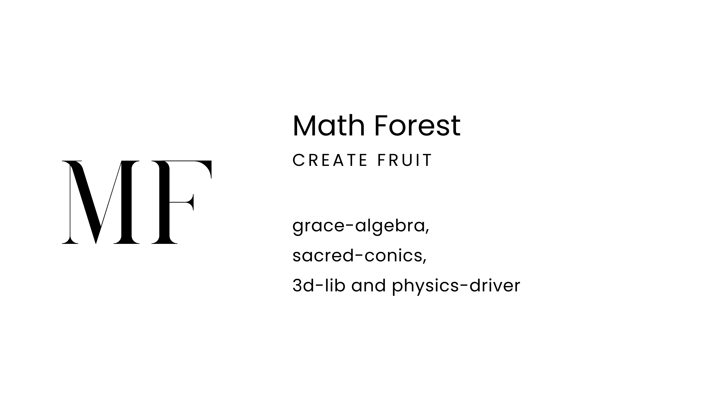

# MathForest

用于dart的数学森林库，包含数学函数，方程，复数，微分，向量，矩阵，圆锥曲线，二次曲面，共生几何，射影几何，统计，概率，物理计算引擎

> [!NOTE]
> 开发中...
> - 计划加入：符号计算，极限与微积分，信号处理
> - 当前状态：正在从lua版本迁移

## 深入了解
是我们的世界—Nature上届机[153]谷的代号-Forest所使用的驱动库 让数学理性主宰认知吧

- 代数🦘

扩展大量数学函数，提供复数和方程求解器

- 几何🐒

携手N-46V-gmk带你走进几何神殿，我们着重编写了强大的几何库，以向量计算为核心，几何对象均可运行在3d环境，提供完整的api进行属性计算和对象互动
亲手使用Plane与Cone交出Conic，感受帕斯卡定理，玩转极点极线，内置的Monxiv画布零距离动态演示几何变换

- 统计🐳

对单列数据和成对数据进行评估，创建分布，按照分布产生随机数

- 物理⛰️

使用欧拉法求解经典物理过程，体验上帝视角
